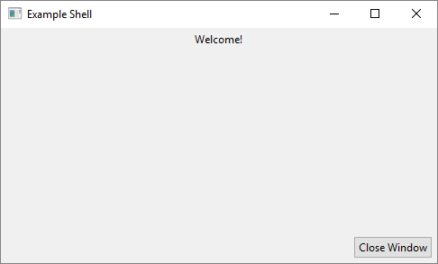

# ShadowAPI/GUI
This module contains helper classes and functions for [SWT](https://www.eclipse.org/swt/).

## DSL
Most of the module is a DSL for creating SWT views.

### Example
If you run the [example code](Example.kt), this is the result: 

