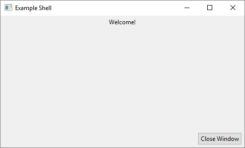

# ShadowAPI/GUI
This module contains helper classes and functions for [SWT](https://www.eclipse.org/swt/).

## DSL
Most of the module is a DSL for creating SWT views.

### Motivation
Typically, creating and positioning a button in SWT looks like this:

```java
Composite parent = new Composite(shell, SWT.NONE);
FormLayout layout = new FormLayout();
layout.spacing = layout.marginHeight = layout.marginWidth = 5;
parent.setLayout(layout);

Button button = new Button(parent, SWT.PUSH);
button.setText("I am a button");

FormData data = new FormData();
data.top = new FormAttachment(0);
data.left = new FormAttachment(0);
data.right = new FormAttachment(100);
button.setLayoutData(data);
```

While it seems repetitive, it's necessary to define all that data. The problem is that it 
*looks* ugly. There's no hierarchy; everything is flat. This makes code hard to read, it's
difficult to see where everything is placed by simply looking at it.

With the help of Kotlin, and by defining a DSL, we solve this problem:

```kotlin
composite(shell) { // The default style is SWT.NONE
    layout = formLayout {
        spacing = 5
        marginWidth = 5
        marginHeight = 5
    }

    button(SWT.PUSH) {
        text = "I am a button"
        layoutData = formData {
            top = FormAttachment(0)
            left = FormAttachment(0)
            right = FormAttachment(100)
        }
    }
}
```
Now that looks a lot better. We can clearly see that the Button belongs inside the Composite,
as well as their appropriate data. 

Note that a parent argument is not supplied to `button()`, the DSL automatically passes the
correct parent. In this case, it is the Composite it is visually a child of.

### Implementation
This is accomplished by subclassing Widgets, adding a DSL annotation to the class, and overriding
the `checkSubclass` method so that it does nothing. According to the dev team of SWT, doing this
is discouraged, but should anything go wrong, it's the implementer's fault; so they better know
what they're doing.

The classes do not alter any of the underlying widget's code, the act as simple wrappers. In some
cases, they add some extension functions helpful to the DSL, but no functions are added to wrapper
class itself.

A similar disclaimer can be seen after the import statements in 
[dsl.kt](src/info/malignantshadow/api/gui/dsl.kt#L40-L50).

### Example
If you run the [example code](src/info/malignantshadow/api/gui/examples/DslExample.kt), this is the result: 



### Adding to the DSL
Expanding the DSL is as simple as adding the `@SwtDsl` annotation to a class, or implementing
the `SwtContainer` interface.

Adding a extension functions to the `SwtContainer` interface will also make those functions available
to any item/class that implements it. This includes (but is not limited to) `Shell`, `Composite`, and `Group`.

An example of `SwtContainer` being implemented for a custom class is an
[item in a OptionComposite](src/info/malignantshadow/api/gui/view/OptionComposite.kt#L80), which allows
the addition of new items to the tree as well as manipulating the `Composite` the item is attached
to.

[Further in the file](src/info/malignantshadow/api/gui/view/OptionComposite.kt#L92), you can also
see an extension function for `SwtContainer`, allowing an `OptionComposite` to be created in any container.